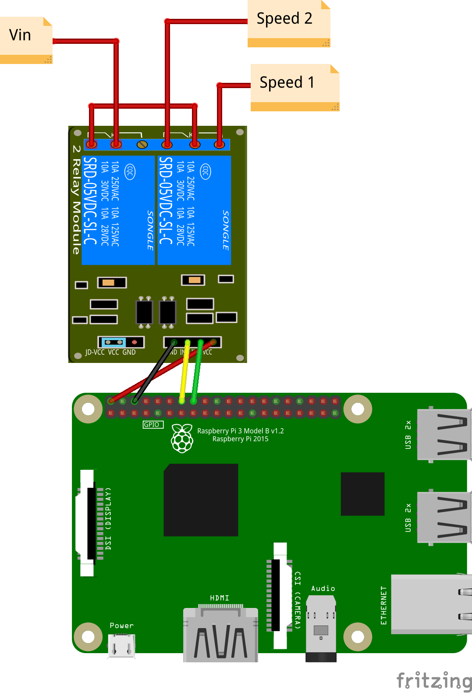

# Automated VMC

Inspired from [hackable VMC](https://git.framasoft.org/axellec/hackable-vmc).

## Hardware

* 1 raspberry pi 3 (or v2 with a wifi doggle) ;
* 1 relay module with 2 relais.



## Software

On a [minibian](https://minibianpi.wordpress.com/).

### Wifi configuration

See the [how to](https://minibianpi.wordpress.com/how-to/wifi/).

### Requirements

```
# apt install jq bc mosquitto-clients
```

### Configuration

Create a new `~/.config/vmc` file:

```
readonly MAX_HUMIDITY=90
readonly MIN_TEMPERATURE=3
readonly MAX_TEMPERATURE=30
readonly WINTER=1
readonly MQTT_HOST='192.168.1.1'
readonly GPIO_INT1=23
readonly GPIO_INT2=24
```

### Execution

Create a new unit for systemd in `/etc/systemd/system/vmc.service`:

```
[Unit]
Description=VMC
After=network.target

[Service]
ExecStart=/root/vmc/src/vmc
Restart=on-failure
```

Enable it:

```
# systemctl enable vmc.service
```

And launch it:

```
# systemctl start vmc.service
```
